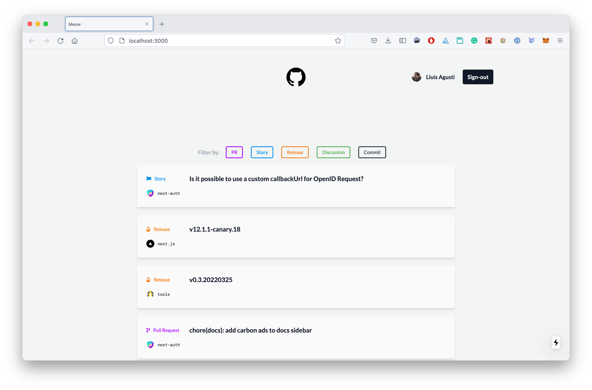

# Meow 🐈‍⬛



A **NextJS** for a beautified experience on managing Github notifications.

## Running locally 🔖

Before you start, you will need:

- [Git](http://git-scm.com/book/en/v2/Getting-Started-Installing-Git)
- [Node.js](https://nodejs.org/download/)
- [Yarn](https://yarnpkg.com/)

Once ready, install all the dependencies:

```
$ yarn
```

Then create an environment file from the example file:

```
$ cp example.env.local env.local
```

- **`GITHUB_CLIENT_ID`**: Obtained when creating an [OAuth App in Github](https://docs.github.com/en/developers/apps/building-oauth-apps/creating-an-oauth-app)
- **`GITHUB_CLIENT_SECRET`**: Obtained when creating an [OAuth App in Github](https://docs.github.com/en/developers/apps/building-oauth-apps/creating-an-oauth-app)
- **`NEXTAUTH_SECRET`**: get it from [here](https://generate-secret.vercel.app/32)

**Note ⚠️ &nbsp;:** _When creating an OAuth app in Github make sure you mark `https://localhost:3000/api/oauth/callback` as the callback URL. You can learn more about OAuth here._

Finally run the development server:

```bash
$ yarn dev
```

Now lets open the app by visiting [`localhost:3000`](http://localhost:3000/) on your browser.

You can run the integration tests like so:

```bash
# Integration tests with Cypress
$ yarn test:int
# Unit tests with Jest
$ yarn test:unit
```

Other interesting commands:

```bash
# Lint the codebase
$ yarn lint
# Check type correctness
$ yarn types
# Check the design system
$ yarn brand:docs
```

Refer to the [NextJS docs](https://nextjs.org/docs/getting-started) if you hit any issues.

## Stack 🧱

- [Tailwind](https://tailwindcss.com/)
- [NextJS](https://nextjs.org/docs/getting-started)
- [NextAuth]()
- [React Query](https://react-query.tanstack.com/)
